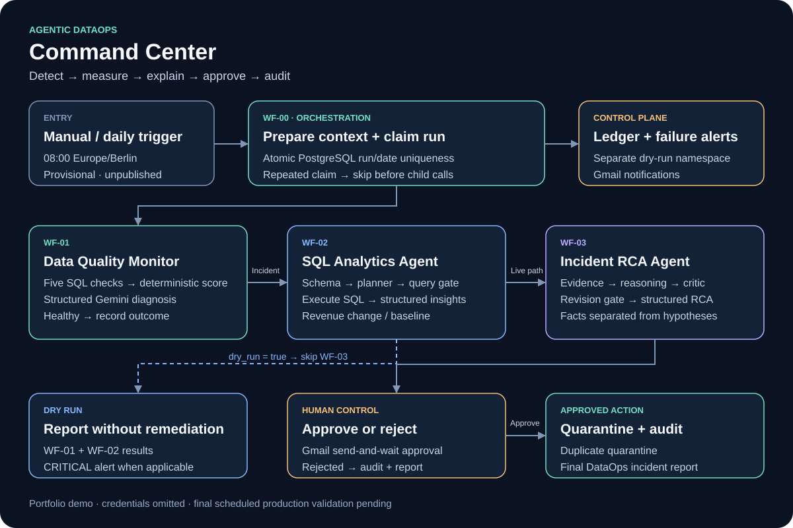

# Agentic DataOps Command Center

A modular n8n project that detects data-quality incidents, measures their analytics impact, builds an evidence-grounded root-cause report, and routes remediation through human approval.

**Status: tested portfolio demo, with production safeguards in progress.** The orchestrator remains unpublished and defaults to dry run. This repository contains sanitized, inactive workflow exports; service credentials and workflow IDs must be configured after import.



## The problem

A failed daily load can appear as a revenue decline while duplicate orders, missing source fields and price anomalies undermine the report. The project separates deterministic detection from analytics and AI interpretation, and puts a person between a proposed data change and its execution.

## Four workflows, four responsibilities

| Workflow | Responsibility | Returned object |
| --- | --- | --- |
| WF-00 — DataOps Orchestrator | Run context, duplicate-run claims, branching, child calls, outcome recording and alerts | One DataOps run or incident result |
| WF-01 — Data Quality Monitor | Five SQL checks, deterministic score, structured AI diagnosis | `workflow`, `status`, `data_quality` |
| WF-02 — SQL Analytics Agent | Schema inspection, SQL planning, query checks, execution and structured insights | `workflow`, `status`, `analytics` |
| WF-03 — Incident RCA Agent | Evidence collection, reasoning, critique/revision, human approval, quarantine and audit | RCA result and approval status |

WF-00 does not duplicate the agents' business SQL or AI reasoning. Its PostgreSQL queries only resolve run identity and maintain the orchestration ledger. A supporting error workflow sends automation-failure notifications.

## Demonstrated incident

For the synthetic incident on **2026-09-28**:

- Five quality checks failed; score **0/100**, severity **CRITICAL**.
- Revenue was **10,595 units** versus a prior seven-day daily average of **28,504.50 units**, a **62.83% decline**. Currency was not supplied.
- The evidence included one duplicate ID group, three missing source values among five orders, one price outlier, and a failed pipeline run.
- An earlier full orchestrator run completed human approval, duplicate quarantine and audit logging, returning `REMEDIATION_APPROVED` with critic score **98**.
- After prompt grounding was tightened, a separate RCA/critic test scored **100** and stopped before approval or remediation.
- A subsequent WF-00 dry run completed WF-01 and WF-02, skipped WF-03 remediation, recorded `DRY_RUN_COMPLETED`, and sent a CRITICAL alert. A repeat returned `SKIPPED_ALREADY_CLAIMED` before invoking child agents.
- An isolated missing-child test returned `FAILED` and sent the failure notification.

These are distinct tests, not one combined production execution. See [sample incident report](samples/incident-report.md), [grounded RCA](samples/grounded-rca.json) and [validation record](docs/validation.md).

## Design choices

- **Deterministic checks first:** volume, duplicate IDs, missing source, price outliers and pipeline failures feed the score before AI interpretation.
- **Modular contracts:** agents can be called independently through Execute Sub-workflow Trigger.
- **Structured outputs:** final Edit Fields nodes preserve strings and nested objects instead of returning disconnected node outputs.
- **Human approval:** WF-03's Gmail send-and-wait branch gates data quarantine; rejected remediation is logged separately.
- **Evidence grounding:** RCA and critic prompts prohibit invented constraint mechanisms, currency symbols, source systems and unsupported loss claims.
- **Durable run claims:** unique keys on `(namespace, run_id)` and `(namespace, incident_date)` prevent another execution from claiming the same incident. Dry runs use a separate namespace.
- **Explicit failures:** child error outputs stop subsequent agents and remediation; a global Error Trigger handler covers unhandled production execution errors.

## Reproduce the demo

1. Create a **new sandbox PostgreSQL/Supabase database**. Apply [schema.sql](database/schema.sql), then optionally [demo-seed.sql](database/demo-seed.sql). The seed is synthetic and was not executed against the original project during packaging.
2. Import WF-01, WF-02, WF-03, the supporting error handler, then WF-00 from the JSON files. Keep all workflows inactive.
3. Reconnect PostgreSQL, Google Gemini and Gmail credentials inside n8n. No credential secrets or credential references are included here. Configure your own notification recipient.
4. In WF-00's three Execute Sub-workflow nodes, select your imported agents. Configure its private n8n base URL where execution links are constructed. Publish the error handler and select it in WF-00's Error Workflow setting.
5. Test WF-01 manually with `target_date: "2026-09-28"`. Test WF-02 with the example analytics question. Confirm one structured object is returned by each.
6. Leave WF-00's `dry_run` default at `true`; execute its Manual Trigger. The demo date is supplied by Initialize Run. Expect the quality and analytics results, outcome record and CRITICAL notification, without invoking WF-03 remediation.
7. Repeat the same manual run to verify duplicate skipping. Do not delete or reset ledger claims just to rerun remediation; review the original execution and outcome first.
8. Test WF-03 only in the sandbox and inspect its fixed demo SQL before proceeding. Gmail approval must come from a human. Do not treat model-generated recommendations as authorization.

The optional, pre-existing WF-01 data-table trigger requires its own table mapping if used; the Manual and DQ Input triggers do not depend on it. Imported placeholder IDs and removed credentials intentionally require setup. These public copies were structurally verified, but have not been imported into a second n8n instance.

## Production work remaining

- Parameterize WF-03's fixed demo date, duplicate target and audit inputs; scope duplicate/price evidence to the incident window.
- Align incident-day boundaries: WF-00 resolves pipeline dates in Europe/Berlin while WF-01 checks use UTC windows.
- Confirm the actual upstream completion time. A provisional schedule is **08:00 Europe/Berlin (CET/CEST)**, targeting the previous calendar day; it remains disabled.
- Supply a fresh upstream load and pass a genuine clock-triggered dry run before publishing WF-00. A manual test of scheduled input correctly stopped at `NO_UPSTREAM_RUN` for September 30.
- Enforce read-only analytics with database permissions, query timeouts and stronger SQL validation. The current keyword gate is an application guard, not a complete SQL security boundary.
- Validate failure recovery, notification retries, concurrency and the approval timeout behavior. Claims remain held after failure; recovery requires review.
- Confirm downstream queries handle quarantined records as intended. The current DQ checks include existing quarantined rows.
- Keep development test callers until several production executions succeed.

## Repository contents

```text
workflows/             Four sanitized n8n workflow exports
supporting-workflows/  Automation failure handler
database/              Inspected schema metadata, schema SQL and synthetic demo seed
assets/                Architecture SVG and Mermaid source
screenshots/           Workflow canvases without browser address bar or credentials
samples/               Grounded RCA, dry-run output and incident report
docs/                  Contracts, validation, configuration and resume bullet
scripts/               Offline package validation
```

Technology: **n8n · PostgreSQL / Supabase · Google Gemini · Gmail · JavaScript · SQL**.

Built by [Naresh Hosahalli Rudresh](https://github.com/hrnareshabd). [Portfolio](https://naresh-hr-portfolio.netlify.app/#projects).
