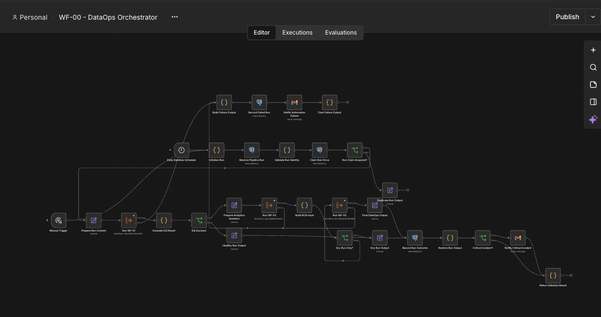
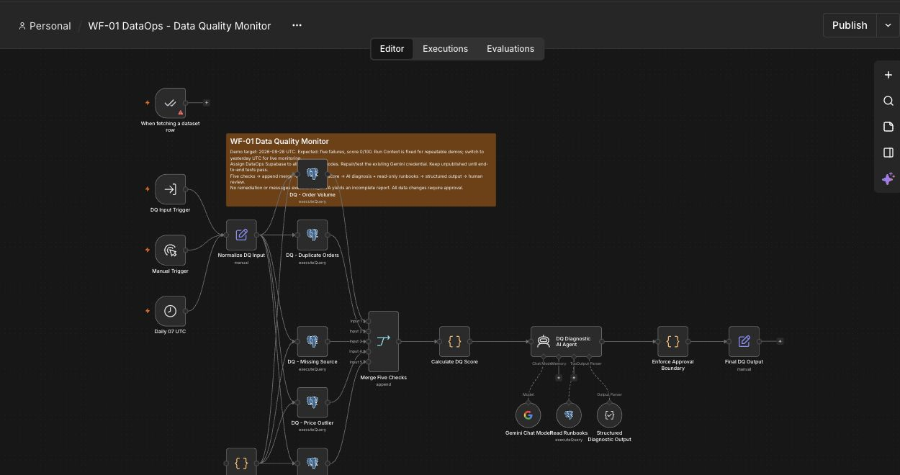
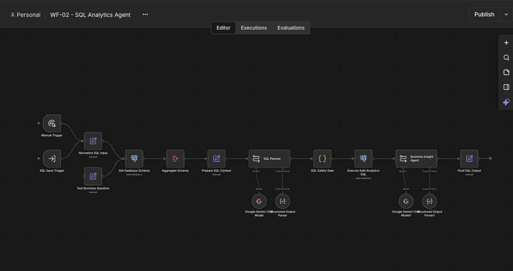
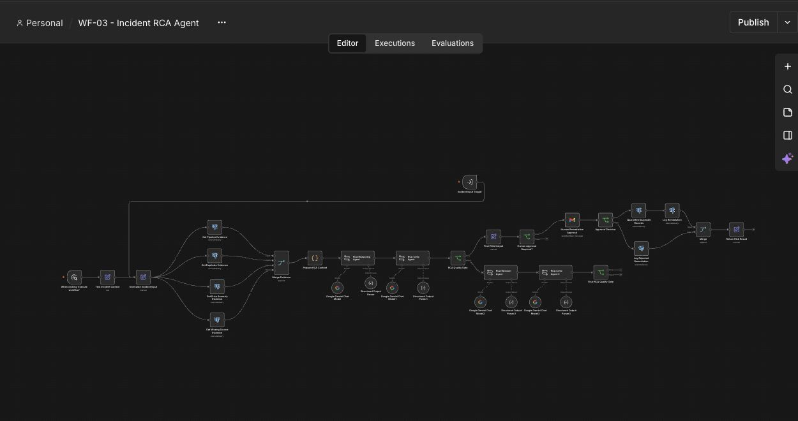

# Workflow screenshots

Screenshots captured from the original n8n editor on October 1, 2026. They exclude the browser address bar and account sidebar; no credential editor is shown.

## WF-00 — orchestration and safeguards

## WF-01 — parallel data-quality checks

## WF-02 — SQL planning, query guard and insights

## WF-03 — evidence, critique, approval and remediation

These are canvas screenshots, not proof of a clock-triggered production execution. Refer to the validation record for test scope and results.
